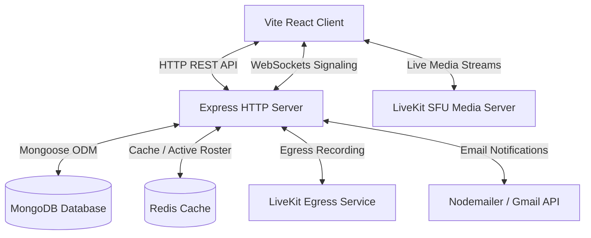

# MeetSphere — Enterprise Video Collaboration Workspace

**MeetSphere** is a high-performance, real-time video collaboration platform built for modern remote teams. It combines robust WebRTC/LiveKit SFU streaming with high-contrast solid dark meeting interfaces, cloud recording (LiveKit Egress), AI noise suppression, and real-time meeting catch-up summaries.

---

## Key Features

- **Solid Dark Meeting Screen UI**: High-contrast, clean solid dark interface (`bg-slate-900` / `bg-surface-container`) designed for video legibility, distraction-free calls, and optimized rendering without GPU-heavy glassmorphism/backdrop blur effects.
- **Accurate Participant Display Names**: Native display name resolution across video grid tiles, speaker indicators, and participant lists using authenticated user names instead of raw MongoDB User IDs.
- **WebRTC & LiveKit SFU Video**: Low-latency multi-party video conferencing, screen sharing, audio controls, and hand-raising powered by `@livekit/components-react`.
- **AI Background Noise Suppression**: Integrated client-side RNNoise WebAssembly module to suppress ambient microphone noise in real time.
- **Cloud Recording & Email Delivery**: Server-side recording via LiveKit Egress (`RoomCompositeEgress`) with automatic Gmail / Nodemailer notifications containing playback links upon recording completion.
- **Real-Time Catch-Up & Summaries**: AI-driven meeting recap service providing real-time transcripts, key discussion points, and action items.
- **Workspace Collaboration**: Dashboard meeting management, instant meeting creation, channel discussions, document sharing, and persistent chat logs.

---

## Architecture Overview



- **Frontend**: React 18 SPA (Vite) structured with custom contextual providers (`AuthContext`, `LiveKitContext`, `SocketContext`).
- **Backend**: Node.js + Express REST API providing authentication, meeting management, token generation (`livekit-server-sdk`), and signaling.
- **Media SFU**: LiveKit SFU engine for WebRTC track publication, audio/video mixing, and bandwidth management.
- **Database**: MongoDB for persistent storage of users, meetings, channels, messages, and document assets.
- **Services**: Cloud recording egress dispatcher, Gmail notification pipeline, TURN/STUN credential service, and RNNoise audio module.

---

## Directory Structure

```
├── client/                     # Frontend Vite SPA
│   ├── src/
│   │   ├── components/         # MeetingRoom, MeetingGrid, ParticipantTile, ControlBar, Modals
│   │   ├── context/            # AuthContext, LiveKitContext, SocketContext
│   │   ├── hooks/              # Custom hooks (useAudioLevel, useMediaDevices, useParticipantSignals)
│   │   ├── pages/              # LobbyPage, RoomPage, MeetingPage, DashboardView, SettingsPage
│   │   ├── services/           # API handlers, meetingService, noiseSuppression
│   │   └── App.jsx             # React router & shell controller
│   ├── index.html
│   ├── vite.config.js
│   └── package.json
├── server/                     # Backend API & Signaling server
│   ├── config/                 # Mongoose connection, LiveKit token generator, Redis, env validator
│   ├── controllers/            # Auth, Meeting, and User controllers
│   ├── middleware/             # JWT auth verification
│   ├── models/                 # User, Meeting, Channel, Document Mongoose schemas
│   ├── routes/                 # Express API routes
│   ├── services/               # Egress recording, email service, TURN service, catch-up service
│   ├── sockets/                # WebSocket signaling handler
│   ├── server.js               # Express application entry point
│   └── package.json
├── docker-compose.yml          # Docker composition for full-stack deployment
├── .env.example                # Environment variables template
└── README.md
```

---

## Getting Started Locally

### Prerequisites

- [Node.js](https://nodejs.org/) v18+
- [MongoDB](https://www.mongodb.com/) instance (local or MongoDB Atlas)
- [LiveKit Server](https://livekit.io/) instance & credentials (API Key and Secret)

### 1. Backend Setup

```bash
cd server

# Copy environment template
copy .env.example .env

# Install dependencies
npm install

# Start backend server
npm run dev
```

The Express API server runs at `http://localhost:5000`.

### 2. Frontend Setup

```bash
cd ../client

# Install dependencies
npm install

# Start Vite dev server
npm run dev
```

Open `http://localhost:3000` in your web browser.

---

## Key API Endpoints

| Method | Endpoint | Description |
| :--- | :--- | :--- |
| `POST` | `/api/auth/register` | Register new user account |
| `POST` | `/api/auth/login` | Authenticate user and issue JWT |
| `POST` | `/api/meetings` | Create or schedule a meeting |
| `GET` | `/api/meetings/user` | Fetch active user meetings |
| `POST` | `/api/meetings/token` | Generate authorized LiveKit room token |
| `POST` | `/api/meetings/:roomId/record` | Initiate cloud egress recording |
| `POST` | `/api/meetings/:roomId/messages` | Send & persist in-meeting chat message |

---

## License

This project is licensed under the MIT License.
